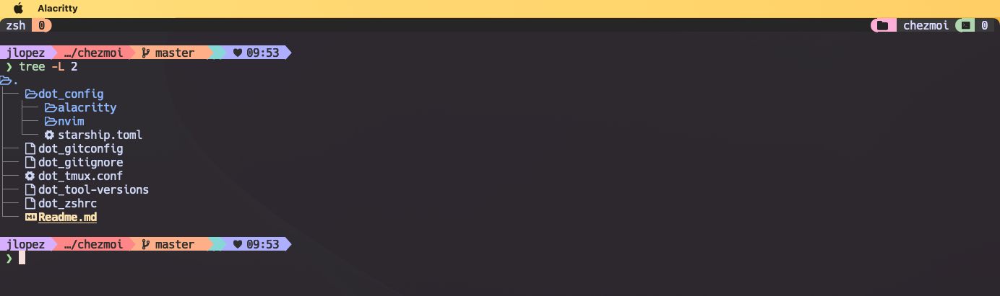
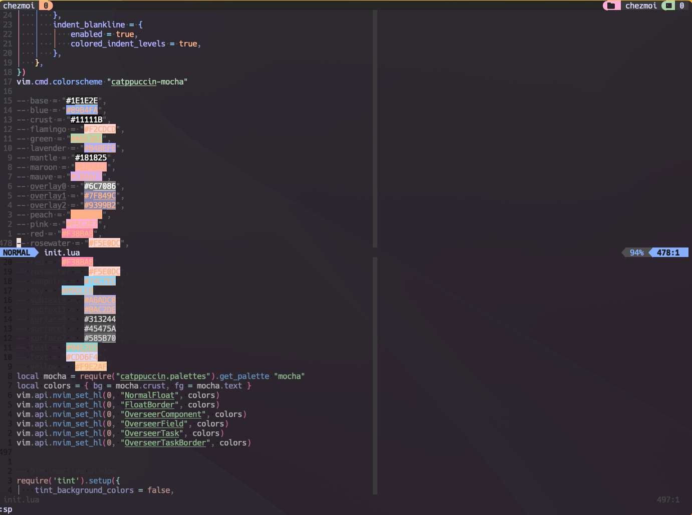

# Dotfiles repo

This are my personal dotfiles using [chezmoi](https://www.chezmoi.io/) to mantain them

## Examples

## After install 

You need to install the plugin managers after you install this dotfiles:

* nvim -> [lazy.nvim](https://github.com/folke/lazy.nvim#-usage)
* tmux -> [tpm](https://github.com/tmux-plugins/tpm)
* zsh -> [zgenom](https://github.com/jandamm/zgenom#installation)
